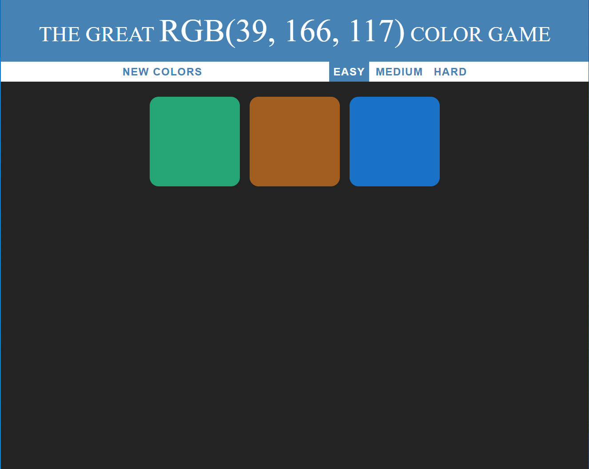
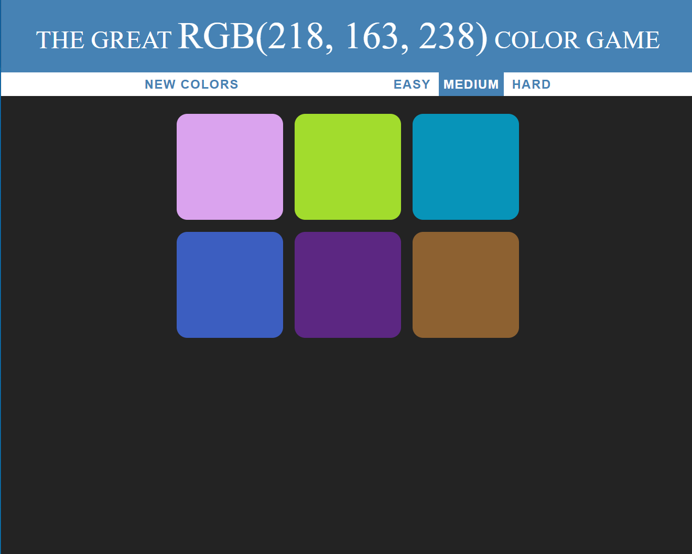

# Randomised RGB Color Game
## [THE GREAT RGB Color GAME](https://chunghakngor.github.io/RGB-Color-Game/)

### Instructions

There are no requirements for this project, it has been completed in pure vanilla Javascript.

You can use either the following step to try the game out:
* Visit the following link: [THE GREAT RGB COLOR GAME](https://chunghakngor.github.io/RGB-Color-Game/)
* Clone the repo and open the `index.html` file with all the other files inside the same directory 

### Some further details:
* The goal of the game is to correctly pick the RGB colour from the square.
* The current goal for each game is shown as `RGB(xxx,xxx,xxx)` format.
* There are 3 levels of difficulity.
* You may choose to restart the game whenever you want by pressing the `NEW COLORS` button.
* The game is responsive to all screen sizes.
* Incorrect answers make the square disappear.
* Correct answer will light up all the square to the correct answers.

### Some screenshot from the game:

---

---

---

